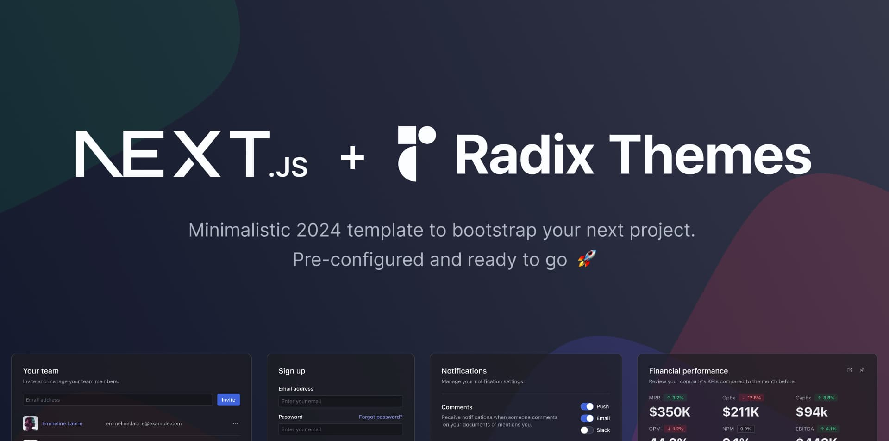

This is a minimalistic [Next.js](https://nextjs.org/) + [Radix Themes](https://www.radix-ui.com/) template to bootstrap your next project with a modern design system.

- **Next.js**: A React framework for building production-grade applications.
- **Radix Themes**: An open-source component library optimized for fast development, easy maintenance, and accessibility.

## Features ✨

- Uses the latest **React 18** version.
- Out of the box support for **TypeScript**.
- **next/font**: Automatically optimize and load fonts from Google Fonts.
- **next-themes**: Perfect Next.js dark mode in 2 lines of code. Support System preference and any other theme with no flashing.
- **Prettier + ESLint** preconfigured with all recommended configs / plugins.
- **Husky + Lint-Staged** pre-commit hooks to ensure code quality.

## Getting Started 🚀

1. Install the dependencies:

```bash
pnpm install
```

2. Run the development server:

```bash
pnpm dev
```

Open [http://localhost:3000](http://localhost:3000) with your browser to see the result.

You can start editing the page by modifying `app/page.tsx`. The page auto-updates as you edit the file.

## Learn More 📖

To learn more about Next.js, take a look at the following resources:

- [Next.js Documentation](https://nextjs.org/docs) - learn about Next.js features and API.
- [Learn Next.js](https://nextjs.org/learn) - an interactive Next.js tutorial.

To learn more about Radix Themes, take a look at the following resources:

- [Radix Themes Documentation](https://www.radix-ui.com/themes/docs) - learn about Radix UI themes and API.
- [Radix Themes Playground](https://www.radix-ui.com/themes/playground) - an interactive playground of Radix UI themes components.

Check out [Next.js GitHub repository](https://github.com/vercel/next.js/) and [Radix Themes GitHub repository](https://github.com/radix-ui/themes) - your feedback and contributions are welcome!
